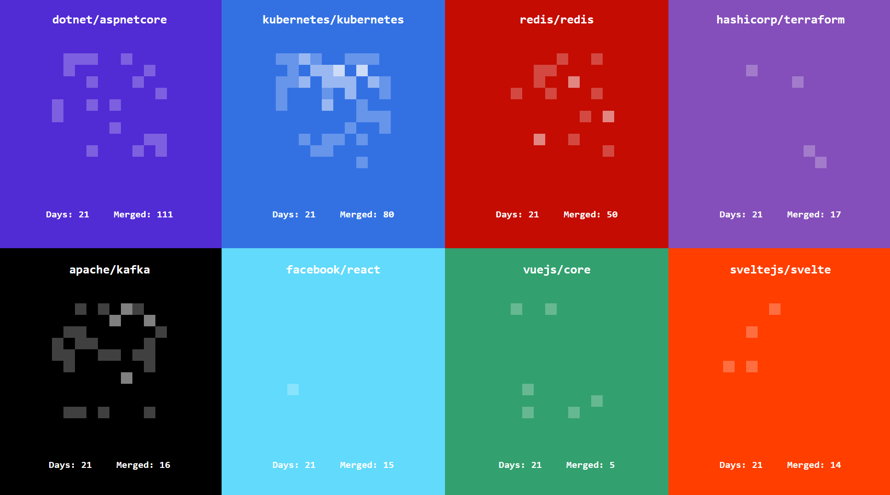

# Rain



Visualizes how fast and often some popular GitHub repositories merge theire PRs. Each square in the animation represents a PR. When it appears on the top, it means the PR was created, and when it reaches the bottom, it means the PR was merged to main line branch.

## See the visualization

```sh
cd visualization
npm run dev
```

The animation will start when you click anywhere on the screen.

## How it works

There is a script under the `crawler/` folder which fetches the PR data and put them as json files under the `data/` folder. Then the data are visualized by a Svelte app under the `visualization/` folder.

## Visualize Other Repos

You can add more data by running the crawler on other repositories.

1. Modify relevant variables in `/crawler/crawler.js` to use the correct repo name, start and end dates, main line branch name and so on. Sorry they are hard coded - not command line args yet :)

2. Run `node ./crawler/crawler.js`. The data should be generated and put under the `data/` folder

3. Then you need to import that data from the app, and perhaps modify the styles a bit to make sure the color and layout look good.

> **NOTE 1** GitHub APIs have a rate limit. If the crawler fails due to the rate limit in the middle of fetching data, it will log the last attempted page number. Then you can resume a while later from that page (remember to change the file name too so that your previously fetched data are not overwritten).

> **NOTE 2** We use the search API, which can only show the first 1000 search results. The means we can't get all the data if there are more than 1000 merged PRs during the period (e.g. Kubernetes). If this is the case, consider split the period into smaller chunks and merge the data in the end.